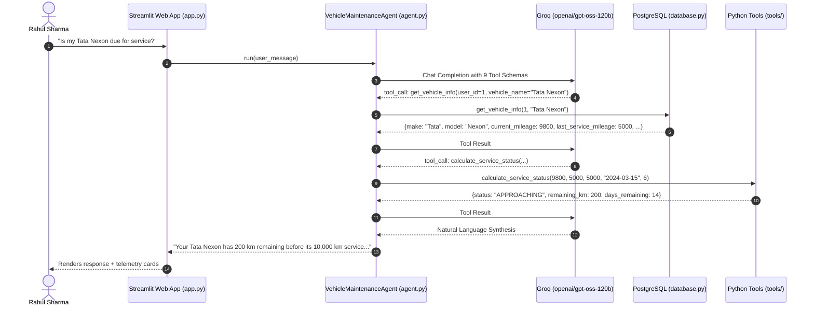

# 🚗 Vehicle Service & Maintenance Management Agent

> An enterprise-grade, deterministic AI assistant powered by **Groq** and `openai/gpt-oss-120b`, purpose-built for predictive vehicle telemetry analysis, authorized workshop discovery, and collision-guaranteed appointment scheduling.

[](https://www.python.org/)
[](https://streamlit.io/)
[](https://groq.com/)
[](https://supabase.com/)
[](https://www.openstreetmap.org/)
[](https://pytest.org/)

---

## 📋 Table of Contents
1. [Project Overview](#-project-overview)
2. [Core Architectural Philosophy](#-core-architectural-philosophy)
3. [Strict LLM & Safety Constraints](#-strict-llm--safety-constraints)
4. [System Architecture & Flow](#-system-architecture--flow)
5. [Database Schema & Integrity](#-database-schema--integrity)
6. [Tools & Dispatch System](#-tools--dispatch-system)
7. [Repository Structure](#-repository-structure)
8. [Installation & Setup Guide](#-installation--setup-guide)
9. [Running the Application](#-running-the-application)
10. [Automated Test Suite (70 Tests)](#-automated-test-suite-70-tests)
11. [Live Demonstration Script](#-live-demonstration-script)
12. [Interview Defense & Technical FAQ](#-interview-defense--technical-faq)
13. [Team Responsibilities](#-team-responsibilities)

---

## 🌟 Project Overview

Modern connected vehicles generate continuous odometer telemetry, but vehicle owners frequently miss critical scheduled maintenance due to fragmented dealer communications, confusing maintenance intervals, and cumbersome manual booking portals.

The **Vehicle Service & Maintenance Management Agent** solves this end-to-end:
- **Predictive Telemetry Monitoring**: Compares real-time odometer readings against manufacturer service schedules.
- **Strict Deterministic Math**: Categorizes status into `OVERDUE`, `DUE`, `APPROACHING` (within 500 km or 30 days), and `NOT_DUE` in pure Python.
- **Geographic Workshop Discovery**: Uses OpenStreetMap Nominatim and Overpass API to geocode addresses and identify nearest authorized workshops with Haversine distance ranking.
- **Atomic Slot Booking**: Verifies real-time availability and prevents double‑booking using composite unique constraints.
- **Multi‑Channel Dispatch**: Emits standardized notification confirmations via SMS and email with human‑readable booking references (`BK10001`).

---

## 🧠 Core Architectural Philosophy

### Separation of Concerns: Python Math vs. LLM Reasoning

```
                     ┌─────────────────────────────────────────┐
                     │            User Request / UI            │
                     └────────────────────┬────────────────────┘
                                          │
                                          ▼
                     ┌─────────────────────────────────────────┐
                     │    Groq: openai/gpt-oss-120b            │
                     │  - Intent Classification                │
                     │  - Function Call Selection              │
                     │  - Natural Language Synthesis           │
                     └────────────────────┬────────────────────┘
                                          │ Emits Tool Call
                                          ▼
┌─────────────────────────────────────────────────────────────────────────────┐
│                       Deterministic Python Execution Engine                 │
│                                                                             │
│  [tools/maintenance.py]   [tools/location.py]      [tools/booking.py]       │
│  - Interval Math          - Nominatim Geocode      - Slot Availability      │
│  - Date Delta Calculation - OSM Overpass Query     - Collision Check        │
│  - Strict Priority Rules  - Haversine Distance     - Reference Generation   │
│                                                                             │
└─────────────────────────────────────┬───────────────────────────────────────┘
                                       │
                                       ▼
                      ┌─────────────────────────────────────────┐
                      │       Supabase PostgreSQL Database      │
                      │  - vehicles, appointments, centers      │
                      │  - UNIQUE(center, date, time)           │
                      └─────────────────────────────────────────┘
```

> **Critical Rule**: **Never let an LLM do calendar or mileage arithmetic.** LLMs are probabilistic language models prone to calculation drift. All date differences, kilometer subtractions, threshold checks, and collision queries are executed in deterministic Python functions. The LLM only receives structured JSON outputs and synthesizes empathetic, professional explanations.

---

## 🔒 Strict LLM & Safety Constraints

1. **Single LLM Enforcement**:
   - Exactly **one model** is used across the entire system: **`openai/gpt-oss-120b`** via the Groq API.
   - Strictly **zero fallback models** (no silent fallbacks to GPT‑4, Claude, Gemini, Llama, or Mistral).
2. **Hard Loop Ceiling**:
   - The agent's autonomous tool‑calling loop enforces a strict **12‑iteration ceiling**.
   - If an edge case or recursive chain attempts a 13th call, execution halts immediately with a user‑friendly diagnostic message.
3. **Exponential Backoff**:
   - Transient network or rate‑limit HTTP errors (429 / 503) retry up to 3 times with exponential backoff ($1\text{s} \to 2\text{s} \to 4\text{s}$).
4. **Explicit User Consent for Booking**:
   - Merely asking *"Is my car due for service?"* evaluates status, but will **never** trigger a booking until the user explicitly requests one.

---

## 🏗️ System Architecture & Flow



---

## 🗄️ Database Schema & Integrity

The PostgreSQL schema ([database/schema.sql](database/schema.sql)) defines 8 relational tables with referential integrity:

| Table Name | Primary Purpose | Key Constraints |
|---|---|---|
| `users` | Owner profile and location | `email UNIQUE`, `phone NOT NULL` |
| `vehicles` | Telemetry, odometer, and last service info | `registration_number UNIQUE`, `user_id FK` |
| `maintenance_schedules` | Manufacturer mileage & month intervals | `vehicle_id FK`, `interval_km > 0` |
| `service_history` | Historical logs of completed services | `vehicle_id FK`, `cost >= 0` |
| `service_centers` | Authorized dealer workshops | `center_id UNIQUE`, `latitude/longitude` |
| `appointments` | Booked service slots with references | **`uq_appointment_slot UNIQUE(service_center_id, appointment_date, appointment_time)`** |
| `notifications` | Audit trail of sent SMS/Email confirmations | `appointment_id FK`, `status CHECK` |
| `agent_conversations` | Historical session transcripts | `user_id FK`, `timestamp` |

### Composite Slot Collision Guarantee
```sql
CONSTRAINT uq_appointment_slot UNIQUE (service_center_id, appointment_date, appointment_time)
```
This PostgreSQL constraint guarantees at the database engine level that two customers can never reserve the same workshop bay at the same time.

---

## 🧰 Tools & Dispatch System

The agent interacts with the world exclusively through 9 typed JSON function schemas dispatched by `execute_tool`:

1. **`get_vehicle_info`**: Retrieves owner's vehicle telemetry.
2. **`get_service_history`**: Fetches previous repair records and dates.
3. **`get_maintenance_schedule`**: Retrieves manufacturer interval rules.
4. **`calculate_service_status`**: Deterministic calculator enforcing:
   - `OVERDUE`: $\text{remaining\_km} < 0 \lor \text{remaining\_days} < 0$
   - `DUE`: $\text{remaining\_km} = 0 \lor \text{remaining\_days} = 0$
   - `APPROACHING`: $0 < \text{remaining\_km} \le 500 \lor 0 < \text{remaining\_days} \le 30$
   - `NOT_DUE`: Otherwise.
5. **`geocode_location`**: Resolves address strings to lat/lon using OpenStreetMap Nominatim.
6. **`search_service_centers`**: Discovers workshops within radius using OSM Overpass API.
7. **`check_availability`**: Retrieves unbooked time slots for a workshop and date.
8. **`book_appointment`**: Atomically reserves a slot and generates `BK10001` reference.
9. **`send_notification`**: Logs and dispatches confirmation messages to SMS and Email.

---

## 📁 Repository Structure

```
Project/
├── app.py                      # Modern 4‑Tab Streamlit Dashboard
├── agent.py                    # Groq openai/gpt-oss-120b Agent Orchestrator
├── database.py                 # Supabase PostgreSQL CRUD & Local Seed Store
├── config.py                   # Environment configuration & model constants
├── demo.py                     # Self‑contained live 7‑step walkthrough script
├── requirements.txt            # Pinned dependencies
├── .env.example                # Template for environment variables
├── .gitignore                  # Git ignore rules
│
├── database/
│   ├── schema.sql              # Supabase PostgreSQL DDL (8 tables + constraints)
│   └── seed.sql                # Rahul Sharma / Tata Nexon demo seed data
│
├── tools/
│   ├── __init__.py
│   ├── maintenance.py          # Deterministic maintenance status calculator
│   ├── location.py             # OpenStreetMap Nominatim geocoding & Overpass radius
│   ├── booking.py              # Slot availability, collision check, reference generator
│   └── notification.py         # Multi‑channel notification dispatcher & logger
│
└── tests/
    ├── __init__.py
    ├── test_database_schema.py # Validates schema.sql DDL and seed.sql constraints (5 tests)
    ├── test_database.py        # Database CRUD, collision checks, updates (9 tests)
    ├── test_maintenance.py     # Deterministic calculator thresholds & priorities (9 tests)
    ├── test_location.py        # Geocoding, Overpass queries, Haversine math (8 tests)
    ├── test_booking.py         # Slot availability, booking refs, collision rejection (7 tests)
    ├── test_notification.py    # Notification formats, validation, DB logging (5 tests)
    ├── test_agent.py           # Tool schemas, dispatcher, loop ceiling, backoff (9 tests)
    ├── test_app.py             # Streamlit AppTest dashboard layout & chat flow (2 tests)
    ├── test_integration.py     # End‑to‑end component wiring & state transitions (2 tests)
    ├── test_e2e.py             # Full Rahul/Tata Nexon persona workflow & edge cases (4 tests)
    └── test_reliability.py     # Network timeouts, corrupt inputs, 10 stress scenarios (10 tests)
```

---

## 🚀 Installation & Setup Guide

### 1. Prerequisites
- **Python 3.10, 3.11, 3.12, or 3.13** installed.
- Git installed.

### 2. Clone and Setup Environment
```bash
# Clone the repository
git clone https://github.com/Aditya4426g/Vehicle-Service-and-Maintenance-Management-Agent.git
cd Vehicle-Service-and-Maintenance-Management-Agent

# Create virtual environment
python -m venv venv

# Activate virtual environment
# Windows (cmd/powershell):
.\\venv\\Scripts\\activate
# macOS/Linux:
source venv/bin/activate

# Install dependencies
pip install -r requirements.txt
```

### 3. Configure Environment Variables
Copy the template file to create `.env`:
```bash
copy .env.example .env
```
Edit `.env` with your API credentials:
```env
# Groq API Configuration (openai/gpt-oss-120b)
GROQ_API_KEY=gsk_your_groq_api_key_here
GROQ_MODEL=openai/gpt-oss-120b

# Optional: Supabase PostgreSQL (Falls back seamlessly to local seed data if blank)
SUPABASE_URL=
SUPABASE_KEY=

# OpenStreetMap Nominatim Configuration
NOMINATIM_USER_AGENT=vehicle_maintenance_agent_v1
```

---

## 🖥️ Running the Application

### Option A: Interactive Streamlit Web App
Launch the modern 4‑tab automotive dashboard:
```bash
streamlit run app.py
```
Open your browser at `http://localhost:8501`.

**Features available in the UI**:
- **Tab 1 (`💬 Agent Assistant`)**: Chat with the agent, ask questions, or click prompt shortcuts.
- **Tab 2 (`📊 Vehicle Telemetry & History`)**: Real‑time odometer readings, service interval progress bar, and past service logs.
- **Tab 3 (`🏢 Workshop Directory`)**: Discovered authorized service centers with distance, rating, phone, and 1‑click booking selection.
- **Tab 4 (`📅 Appointments & Alerts`)**: Active booking cards, reference codes, and sent notification audit logs.
- **Sidebar**: Quick vehicle specs and a `🔄 Reset Conversation` button.

### Option B: Terminal Live Demo Walkthrough
Run the automated, self‑contained walkthrough script:
```bash
python demo.py
```

---

## 🧪 Automated Test Suite (70 Tests)

The repository features comprehensive automated test coverage across 11 test files.

Run all tests:
```bash
python -m pytest tests/ -v
```

Expected output:
```text
============================= test session starts =============================
collected 70 items

... (output omitted for brevity) ...
============================= 70 passed in 39.78s =============================
```

To run a specific test module:
```bash
python -m pytest tests/test_maintenance.py -v
python -m pytest tests/test_reliability.py -v
```

---

## 🎯 Live Demonstration Script

The script `demo.py` demonstrates the full user persona without requiring any manual setup:
1. **Telemetry**: Retrieves Rahul's Tata Nexon ($9,800$ km).
2. **Maintenance Check**: Calculates status $\to$ `APPROACHING` ($200$ km left before $10,000$ km).
3. **Workshop Search**: Geocodes Indiranagar, Bangalore and ranks workshops by distance.
4. **Availability**: Identifies open time slots for tomorrow.
5. **Booking**: Atomically books `09:00 AM` and generates reference `BK10001`.
6. **Notification**: Dispatches SMS and Email confirmation logs.
7. **Collision Rejection**: Deliberately attempts to double‑book the same slot and verifies that the system blocks the collision.

---

## 📄 License
Distributed under the MIT License. See `LICENSE` for more information.
