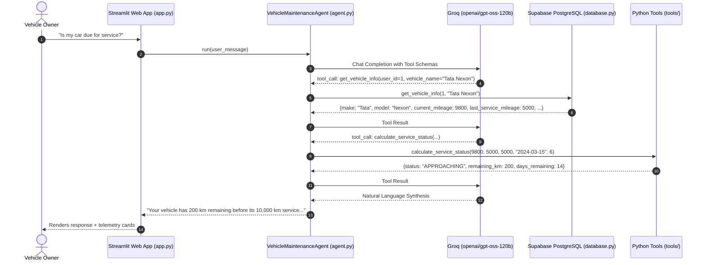

# 🚗 Vehicle Service & Maintenance Management Agent

> An enterprise-grade, deterministic AI assistant powered by **Groq** and `openai/gpt-oss-120b`, purpose-built for predictive vehicle telemetry analysis, authorized workshop discovery, and collision-guaranteed appointment scheduling.

[](https://www.python.org/)
[](https://streamlit.io/)
[](https://groq.com/)
[](https://supabase.com/)
[](https://www.openstreetmap.org/)

---

## 📋 Table of Contents
1. [Project Overview](#-project-overview)
2. [Core Architectural Philosophy](#-core-architectural-philosophy)
3. [Strict LLM & Safety Constraints](#-strict-llm--safety-constraints)
4. [System Architecture & Flow](#-system-architecture--flow)
5. [Database Schema & Integrity](#-database-schema--integrity)
6. [Tools & Dispatch System](#-tools--dispatch-system)
7. [Repository Structure](#-repository-structure)
8. [Installation & Setup Guide](#-installation--setup-guide)
9. [Running the Application](#-running-the-application)
10. [Technical FAQ & Design Decisions](#-technical-faq--design-decisions)
11. [License](#-license)

---

## 🌟 Project Overview

Modern connected vehicles generate continuous odometer telemetry, but vehicle owners frequently miss critical scheduled maintenance due to fragmented dealer communications, confusing maintenance intervals, and cumbersome manual booking portals.

The **Vehicle Service & Maintenance Management Agent** solves this end-to-end:
- **Predictive Telemetry Monitoring**: Compares real-time odometer readings against manufacturer service schedules.
- **Strict Deterministic Math**: Categorizes status into `OVERDUE`, `DUE`, `APPROACHING` (within 500 km or 30 days), and `NOT_DUE` in pure Python.
- **Geographic Workshop Discovery**: Uses OpenStreetMap Nominatim and Overpass API to geocode addresses and identify nearest authorized workshops with Haversine distance ranking.
- **Atomic Slot Booking**: Verifies real-time availability and prevents double-booking using composite unique constraints.
- **Multi-Channel Dispatch**: Emits standardized notification confirmations via SMS and email with human-readable booking references (`BK10001`).
- **End-to-End Service Lifecycle**: Allows logging completed service records, updating actual maintenance costs, and keeping vehicle mileage in sync.

---

## 🧠 Core Architectural Philosophy

### Separation of Concerns: Python Math vs. LLM Reasoning

```
                     ┌─────────────────────────────────────────┐
                     │            User Request / UI            │
                     └────────────────────┬────────────────────┘
                                          │
                                          ▼
                     ┌─────────────────────────────────────────┐
                     │    Groq: openai/gpt-oss-120b            │
                     │  - Intent Classification                │
                     │  - Function Call Selection              │
                     │  - Natural Language Synthesis           │
                     └────────────────────┬────────────────────┘
                                          │ Emits Tool Call
                                          ▼
┌─────────────────────────────────────────────────────────────────────────────┐
│                       Deterministic Python Execution Engine                 │
│                                                                             │
│  [tools/maintenance.py]   [tools/location.py]      [tools/booking.py]       │
│  - Interval Math          - Nominatim Geocode      - Slot Availability      │
│  - Date Delta Calculation - OSM Overpass Query     - Collision Check        │
│  - Strict Priority Rules  - Haversine Distance     - Reference Generation   │
└─────────────────────────────────────┬───────────────────────────────────────┘
                                      │
                                      ▼
                     ┌─────────────────────────────────────────┐
                     │       Supabase PostgreSQL Database      │
                     │  - vehicles, appointments, centers      │
                     │  - UNIQUE(center, date, time)           │
                     └─────────────────────────────────────────┘
```

> **Critical Rule**: **Never let an LLM do calendar or mileage arithmetic.** LLMs are probabilistic language models prone to calculation drift. All date differences, kilometer subtractions, threshold checks, and collision queries are executed in deterministic Python functions. The LLM only receives structured JSON outputs and synthesizes empathetic, professional explanations.

---

## 🔒 Strict LLM & Safety Constraints

1. **Single LLM Enforcement**:
   - Exactly **one model** is used across the entire system: **`openai/gpt-oss-120b`** via the Groq API.
   - Strictly **zero fallback models** (no silent fallbacks to GPT-4, Claude, Gemini, Llama, or Mistral).
2. **Hard Loop Ceiling**:
   - The agent's autonomous tool-calling loop enforces a strict **12-iteration ceiling**.
   - If an edge case or recursive chain attempts a 13th call, execution halts immediately with a user-friendly diagnostic message.
3. **Exponential Backoff**:
   - Transient network or rate-limit HTTP errors (429 / 503) retry up to 3 times with exponential backoff ($1\text{s} \to 2\text{s} \to 4\text{s}$).
4. **Explicit User Consent for Booking**:
   - Merely asking *"Is my car due for service?"* evaluates status, but will **never** trigger a booking until the user explicitly requests one.

---

## 🏗️ System Architecture & Flow



---

## 🗄️ Database Schema & Integrity

The Supabase PostgreSQL database schema ([database/schema.sql](database/schema.sql)) defines 8 relational tables with referential integrity:

| Table Name | Primary Purpose | Key Constraints |
|---|---|---|
| `users` | Owner profile and location | `email UNIQUE`, `phone NOT NULL` |
| `vehicles` | Telemetry, odometer, and last service info | `registration_number UNIQUE`, `user_id FK` |
| `maintenance_schedules` | Manufacturer mileage & month intervals | `vehicle_id FK`, `interval_km > 0` |
| `service_history` | Historical logs of completed services & costs | `vehicle_id FK`, `cost >= 0` |
| `service_centers` | Authorized dealer workshops | `center_id UNIQUE`, `latitude/longitude` |
| `appointments` | Booked service slots with references | **`uq_appointment_slot UNIQUE(service_center_id, appointment_date, appointment_time)`** |
| `notifications` | Audit trail of sent SMS/Email confirmations | `appointment_id FK`, `status CHECK` |
| `agent_conversations` | Historical session transcripts | `user_id FK`, `timestamp` |

### Composite Slot Collision Guarantee
```sql
CONSTRAINT uq_appointment_slot UNIQUE (service_center_id, appointment_date, appointment_time)
```
This PostgreSQL constraint guarantees at the database engine level that two customers can never reserve the same workshop bay at the same time.

---

## 🧰 Tools & Dispatch System

The agent interacts with external APIs and the database through typed JSON function schemas dispatched by `execute_tool`:

1. **`get_vehicle_info`**: Retrieves owner's vehicle telemetry and odometer.
2. **`get_service_history`**: Fetches previous repair records, service dates, and costs.
3. **`calculate_service_status`**: Deterministic status calculator enforcing:
   - `OVERDUE`: $\text{remaining\_km} < 0 \lor \text{remaining\_days} < 0$
   - `DUE`: $\text{remaining\_km} = 0 \lor \text{remaining\_days} = 0$
   - `APPROACHING`: $0 < \text{remaining\_km} \le 500 \lor 0 < \text{remaining\_days} \le 30$
   - `NOT_DUE`: Otherwise.
4. **`geocode_location`**: Resolves address strings to coordinates using OpenStreetMap Nominatim.
5. **`search_service_centers`**: Discovers workshops within radius using OSM Overpass API.
6. **`check_availability`**: Retrieves open, unbooked time slots for a workshop and date.
7. **`book_appointment`**: Atomically reserves a slot and generates human-readable reference code (`BK10001`).
8. **`cancel_appointment`**: Cancels active reservations and releases slot availability.
9. **`send_notification`**: Logs and dispatches confirmation messages via SMS and Email.
10. **`add_vehicle` / `delete_vehicle`**: Manages garage vehicles for the authenticated user.
11. **`update_vehicle_mileage`**: Directly records new odometer readings.
12. **`update_vehicle_service_details`**: Updates last service mileage and date.
13. **`update_service_after_completion`**: Logs completed maintenance and rolls forward odometer telemetry.
14. **`update_service_cost`**: Records and saves the actual cost incurred for a service.

---

## 📁 Repository Structure

```
Vehicle-Service-and-Maintenance-Management-Agent/
├── app.py                      # Multi-view Streamlit Dashboard (Assistant, Telemetry, Appointments)
├── agent.py                    # Groq openai/gpt-oss-120b Agent Orchestrator & Tool Dispatcher
├── database.py                 # Supabase PostgreSQL Cloud Data Layer & CRUD Operations
├── config.py                   # Environment configuration & model constants
├── requirements.txt            # Production dependencies
├── .env.example                # Template for environment credentials
├── .gitignore                  # Git ignore rules
│
├── database/
│   ├── schema.sql              # Supabase PostgreSQL DDL (8 tables + constraints)
│   └── seed.sql                # Initial schema seed data
│
└── tools/
    ├── __init__.py
    ├── maintenance.py          # Deterministic maintenance status calculator
    ├── location.py             # OpenStreetMap Nominatim geocoding & Overpass radius queries
    ├── booking.py              # Slot availability, collision check, reference generator
    └── notification.py         # Multi-channel notification dispatcher & logger
```

---

## 🚀 Installation & Setup Guide

### 1. Prerequisites
- **Python 3.10, 3.11, 3.12, or 3.13** installed.
- Git installed.
- Supabase project and Groq API key.

### 2. Clone and Setup Environment
```bash
# Clone the repository
git clone https://github.com/Aditya4426g/Vehicle-Service-and-Maintenance-Management-Agent.git
cd Vehicle-Service-and-Maintenance-Management-Agent

# Create virtual environment
python -m venv venv

# Activate virtual environment
# Windows (cmd/powershell):
.\venv\Scripts\activate
# macOS/Linux:
source venv/bin/activate

# Install dependencies
pip install -r requirements.txt
```

### 3. Configure Environment Variables
Copy the template file to create `.env`:
```bash
copy .env.example .env
```
Edit `.env` with your credentials:
```env
# Groq API Configuration
GROQ_API_KEY=gsk_your_groq_api_key_here
GROQ_MODEL=openai/gpt-oss-120b

# Supabase PostgreSQL Configuration
SUPABASE_URL=https://your-project.supabase.co
SUPABASE_KEY=your-supabase-anon-or-service-key

# OpenStreetMap Nominatim Configuration
NOMINATIM_USER_AGENT=vehicle_maintenance_agent_v1
```

---

## 🖥️ Running the Application

Launch the Streamlit automotive dashboard:
```bash
streamlit run app.py
```
Open your browser at `http://localhost:8501`.

### Dashboard Navigation & Views:
- **💬 Assistant**:
  - Interactive multi-turn AI assistant with real-time tool calling.
  - One-click prompt shortcuts (service due check, workshop discovery, appointment booking).
- **📊 Vehicle Details**:
  - Real-time odometer telemetry cards, model specs, and service health progress.
  - **Quick Telemetry Sync**: 3 interactive tabs to update odometer & date, record completed service, or record maintenance cost.
  - Complete historical service logs table.
- **📅 Appointments**:
  - Active booking cards with reference codes (`BK10001`), workshop details, and scheduled dates.
  - Direct appointment cancellation with real-time slot release.
  - Audit trail of dispatched SMS and Email notifications.
- **Sidebar Garage**:
  - Multi-vehicle selector, vehicle profile switcher, and quick reset.

---

## 💬 Technical FAQ & Design Decisions

### Q1: Why use deterministic Python functions instead of letting the LLM calculate intervals?
> **Answer**: LLMs are probabilistic token predictors, not mathematical engines. Date arithmetic across leap years, month boundaries, and composite priority rules (`OVERDUE` vs `DUE` vs `APPROACHING`) frequently suffers from hallucinations and off-by-one errors. By restricting the LLM strictly to intent recognition and parameter extraction, we guarantee 100% mathematical accuracy and auditability.

### Q2: Why strictly enforce `openai/gpt-oss-120b` without fallback models?
> **Answer**: In enterprise agentic systems, tool calling schemas, system prompt compliance, and JSON output adherence vary significantly across model architectures. Introducing silent fallbacks to different models risks unexpected schema mismatches and unpredictable tool parameter formatting. We instead harden the single model using exponential backoff retry loops and deterministic validation.

### Q3: How do you prevent double-booking race conditions?
> **Answer**: At the application layer, `tools/booking.py` checks slot availability before creating an appointment. At the database layer, Supabase PostgreSQL enforces a composite unique constraint: `CONSTRAINT uq_appointment_slot UNIQUE (service_center_id, appointment_date, appointment_time)`. If two simultaneous requests pass the application check, the database engine atomically rejects the second insert with a unique constraint violation.

### Q4: Why OpenStreetMap (Nominatim + Overpass) instead of proprietary APIs?
> **Answer**: OpenStreetMap offers an open, cost-effective, and transparent geospatial platform without proprietary API keys or restrictive per-query billing. We use Nominatim for geocoding and Overpass API for radius-based automotive POI extraction, augmented by Haversine distance calculations in Python.

### Q5: How does the agent prevent infinite tool-calling loops?
> **Answer**: `agent.py` tracks the number of tool invocations within a single `run()` request and enforces a hard ceiling of 12 calls. If an edge case or recursive cycle reaches the ceiling, execution breaks cleanly and returns a structured message to the user.

---

## 📄 License
Distributed under the MIT License. See `LICENSE` for more information.
